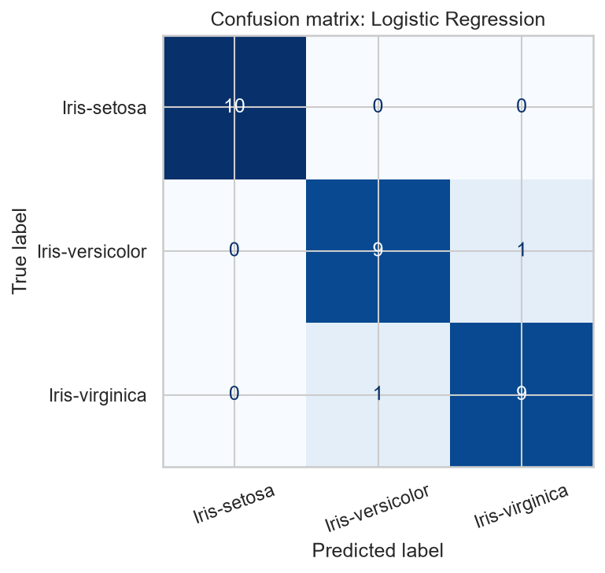

# Iris Flower Classification

Machine learning project completed as part of the **CodeAlpha Data Science Internship (Task 1)**.

## Problem statement

Classify Iris flowers into three species (*Iris-setosa*, *Iris-versicolor*, *Iris-virginica*) using four measurements: sepal length, sepal width, petal length and petal width.

## Dataset

- Source: [Iris.csv on Kaggle](https://www.kaggle.com/datasets/saurabh00007/iriscsv) (the dataset linked in the CodeAlpha task document)
- 150 rows, 6 columns (`Id`, `SepalLengthCm`, `SepalWidthCm`, `PetalLengthCm`, `PetalWidthCm`, `Species`), 50 flowers per species
- No missing values; 3 duplicate rows (ignoring `Id`) were removed, leaving 147 rows
- `Id` was dropped because it is only a row number (the file is sorted by species)

## Methodology

1. Data inspection and cleaning (missing values, duplicates, `Id` column)
2. Exploratory data analysis: summary statistics, pairplot, boxplots
3. Feature/target separation and an 80/20 stratified train-test split (`random_state=42`)
4. Three models compared with 5-fold stratified cross-validation on the training set only: Logistic Regression, KNN, Decision Tree
5. Scaling (`StandardScaler`) is inside a scikit-learn `Pipeline`, so it is fit only on training data (no data leakage)
6. The final model was selected by the highest cross-validation mean accuracy, then evaluated once on the test set

## Results

| Model | CV mean accuracy | CV std |
|---|---|---|
| Logistic Regression | 0.957 | 0.038 |
| KNN | 0.948 | 0.051 |
| Decision Tree | 0.940 | 0.044 |

**Final model: Logistic Regression**, test accuracy **0.933** (28 of 30 test flowers correct).

| Species | Precision | Recall | F1-score | Support |
|---|---|---|---|---|
| Iris-setosa | 1.00 | 1.00 | 1.00 | 10 |
| Iris-versicolor | 0.90 | 0.90 | 0.90 | 10 |
| Iris-virginica | 0.90 | 0.90 | 0.90 | 10 |



## Key findings

**Observations**

- Setosa forms a separate cluster in the petal length and petal width plots; versicolor and virginica overlap more, especially in the sepal measurements.
- All errors on the test set were between versicolor and virginica.

**Interpretation and limitations**

- Petal measurements appear more useful than sepal measurements for separating the species, but this comes from the EDA plots; feature importance was not tested.
- The three models have close cross-validation scores (differences are smaller than the standard deviations), so Logistic Regression is not clearly better than the others.
- The test set has only 30 flowers, so one wrong prediction changes accuracy by about 3.3 points.

## Project structure

```
CodeAlpha_IrisClassification/
├── data/Iris.csv
├── notebooks/Iris_Classification.ipynb
├── models/iris_model.joblib
├── visualizations/   (pairplot, boxplots, confusion matrix)
├── requirements.txt
└── README.md
```

## How to run

```bash
pip install -r requirements.txt
pip install jupyter
```

Then open `notebooks/Iris_Classification.ipynb` in VS Code or Jupyter and choose **Run All**. The notebook reads `../data/Iris.csv`, so keep the folder structure as shown above.

## Tools

Python, pandas, NumPy, Matplotlib, Seaborn, scikit-learn, joblib, Jupyter Notebook, VS Code

## Author

RITESH75419 (GitHub)